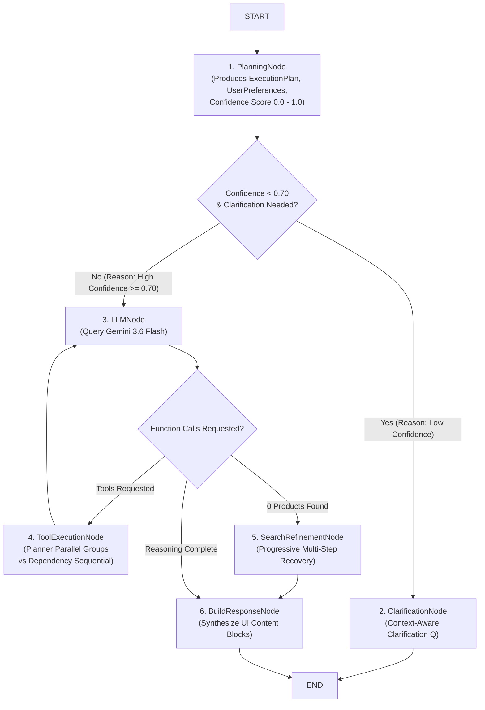

# Ominify AI Assistant Service (`assistant-service`)

Independent FastAPI microservice providing an AI-powered conversational shopping assistant for the Ominify e-commerce platform.

---

## Architecture & Cognitive Intelligence (Phase 4.8)

```text
                        Frontend (`apps/client`)
                                   │
                                   ▼
             FastAPI (`assistant-service` - Port 8004)
        [REST API & Standardized SSE Endpoint /messages/stream]
                                   │
      ┌────────────────────────────┼────────────────────────────┐
      │                            │                            │
      ▼                            ▼                            ▼
Authentication               Conversation                 Assistant
 (Clerk JWT)                  Management                Orchestrator
                                                                │
                                                                ▼
                                                       Reasoning LangGraph
                                                          (StateGraph)
                                                                │
                                                                ▼
                                                          PlanningNode
                                                    (Strongly Typed ExecutionPlan)
                                                                │
                                   ┌────────────────────────────┴────────────────────────────┐
                                   ▼                                                         ▼
                           ClarificationNode                                              LLMNode
                     (Context-Aware Questions)                              (Confidence >= 0.70)
                                                                                             │
                                                                 ┌───────────────────────────┴───────────────────────────┐
                                                                 ▼                                                       ▼
                                                       ToolExecutionNode                                       SearchRefinementNode
                                                  (Planner Dependency Graph)                                  (Multi-Step Progressive)
                                                                 │                                                       │
                                                                 └───────────────────────────┬───────────────────────────┘
                                                                                             ▼
                                                                                     BuildResponseNode
                                                                                   (UI Content Blocks)
```

---

## State Machine Workflow & Reasoning Graph



---

## Strongly Typed `ExecutionPlan` & `UserPreferences`

```python
class UserPreferences(BaseModel):
    budget: Optional[str] = Field(default=None, description="Max budget or price constraint")
    brand: Optional[str] = Field(default=None, description="Preferred brand name(s)")
    color: Optional[str] = Field(default=None, description="Preferred color")
    size: Optional[str] = Field(default=None, description="Size specification")
    material: Optional[str] = Field(default=None, description="Material preference")
    gender: Optional[str] = Field(default=None, description="Gender target (men, women, unisex)")
    purpose: Optional[str] = Field(default=None, description="Usage purpose (running, formal, gaming)")
    negative_preferences: List[str] = Field(default_factory=list)
    rejected_products: List[str] = Field(default_factory=list)

class ExecutionPlan(BaseModel):
    intent: str
    shopping_objective: str
    extracted_preferences: Dict[str, Any]
    confidence: float  # 0.0 to 1.0
    required_tools: List[str]
    execution_order: List[str]
    parallel_groups: List[List[str]]
    dependencies: Dict[str, List[str]]
    expected_outputs: List[str]
    clarification_needed: bool
    clarification_question: Optional[str]
    reasoning: str
```

---

## Explainable Routing Traces (`routing_reasons`)

Every routing decision appends an explicit explanation string to `state["routing_reasons"]`:

```python
# Low Confidence Ambiguous Query
"Planning -> Clarification (Reason: Low confidence 0.45 for ambiguous query)"

# High Confidence Clear Query
"Planning -> LLM (Reason: High confidence 0.95 for clear intent 'search_products')"

# Function Call Execution
"LLM -> Tool Execution (Reason: Gemini requested 1 native function call(s) on pass 1/5)"

# Progressive Recovery
"LLM -> Search Refinement (Reason: 0 products returned on initial search attempt 0)"
```

---

## Progressive Search Refinement Recovery Chain

When a product search returns `0` items, `SearchRefinementNode` executes a multi-step recovery sequence:
1. Original query search
2. Remove restrictive price/brand filters
3. Expand query synonyms
4. Store category search
5. Alternative product recommendations

Each step is logged in `state["search_refinement_history"]`.

---

## Roadmap

- **Phase 1 ✅**: Core FastAPI foundation, configuration, logging, database session setup, dependency injection, and abstract interfaces.
- **Phase 2 ✅**: Database ORM models (`Conversation`, `Message`), Alembic migrations, Clerk JWT authentication, repository pattern, service layer, and conversation/message REST endpoints.
- **Phase 2.5 ✅**: PostgreSQL primary database configuration, timezone-aware UTC datetimes (`datetime.now(UTC)`), authentication security hardening, `ProductClient` interface expansion, and `AssistantOrchestrator` workflow documentation.
- **Phase 3 ✅**: Official Gemini `google-genai` SDK integration, `PromptBuilder`, `ProductClient` async `httpx` implementation, tool function calling execution, official Clerk auth verification, and full AI shopping assistant message flow.
- **Phase 3.5 ✅**: Native `google-genai` function calling (`FunctionCall` -> `FunctionResponse`), multi-turn tool execution, removal of raw tool JSON responses, `GEMINI_MODEL=gemini-3.6-flash` configuration, and Express product service endpoint routing.
- **Phase 3.8 ✅**: Production Hardening — `ToolRegistry`, `ProductClient` exponential backoff retries, request ID log tracing context, latency & token metrics, startup config validation, centralized domain exceptions, and unit test suite expansion (`14 passed`).
- **Phase 4 ✅**: LangGraph StateGraph state machine agent orchestration, strongly typed `AssistantState`, parallel tool execution (`asyncio.gather()`), `MemorySaver` thread checkpointing, conversation summarization, native Gemini streaming (`generate_content_stream`), and SSE REST endpoint (`POST /messages/stream`).
- **Phase 4.5 ✅**: Agent Intelligence & Workflow Refinement — State-driven dynamic routing, `PlanningNode`, `ClarificationNode`, `SearchRefinementNode`, dependency-aware tool scheduling, `CheckpointerFactory` abstraction, and standardized SSE stream sequence (`21 passed`).
- **Phase 4.8 ✅**: Cognitive Intelligence & Reasoning Optimization — Strongly typed `ExecutionPlan` and `UserPreferences` schemas, confidence scoring (0.0 to 1.0), explainable routing traces (`routing_reasons`), context-aware clarification, progressive search refinement recovery chain, and long-term preference memory (`20 passed`).

---

## Getting Started & Verification

```bash
# Navigate to service directory
cd apps/assistant-service

# Run Alembic migrations
uv run alembic upgrade head

# Run automated unit and integration test suite (20 passed)
uv run pytest

# Start local dev server
uv run uvicorn app.main:app --reload --port 8004
```

- **Root Info**: `http://localhost:8004/`
- **Health Check**: `http://localhost:8004/health`
- **Swagger Docs**: `http://localhost:8004/docs`
- **SSE Stream**: `POST http://localhost:8004/api/v1/conversations/{id}/messages/stream`
