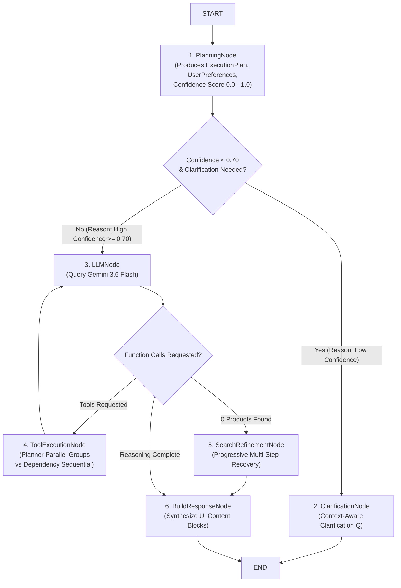

# Comprehensive System Guide & Recent Changes (`changes.md`)
**Ominify AI Assistant Microservice (`assistant-service`)**

---

## 1. Executive Overview

The **`assistant-service`** is an independent, standalone FastAPI microservice running on **Port 8004** that powers the conversational AI shopping assistant for the Ominify e-commerce platform.

It communicates with:
- **Client Frontend (`apps/client`)**: Via REST API and Server-Sent Events (SSE) streaming endpoints.
- **Product Microservice (`product-service`)**: Via Port 8000 Express HTTP endpoints (`/products?search=...`, `/products/:id`, `/categories`) with exponential backoff resiliency.
- **Clerk Authentication Service**: Validates JWT authentication tokens.
- **Google Gemini API**: Utilizes the official `google-genai` SDK (`gemini-3.6-flash`) for native function calling and response streaming.
- **PostgreSQL Database**: Persists conversation threads and message history via SQLAlchemy ORM and Alembic migrations.

---

## 2. Complete End-to-End Workflow of the Assistant Service

Below is the step-by-step lifecycle of every incoming user message:

```text
User Request ──► [FastAPI Middleware: X-Request-ID & ContextVars]
                        │
                        ▼
            [Authentication: Clerk JWT Validation]
                        │
                        ▼
         [Message API Route / MessageService]
     (Validates ownership & persists user prompt entry)
                        │
                        ▼
            [AssistantOrchestrator]
                        │
                        ▼
             [LangGraph StateGraph Agent]
   ┌────────────────────┴────────────────────┐
   ▼                                         ▼
1. PlanningNode                           2. ClarificationNode
(Produces ExecutionPlan,                   (Low confidence < 0.70?
 UserPreferences, Confidence)               Asks targeted Qs)
   │                                         │
   ▼                                         └──────► Final Response
3. LLMNode (Gemini 3.6 Flash)
   │
   ├──────► 4. ToolExecutionNode (Parallel asyncio.gather for independent tools)
   │               │
   │               └──────► Re-query LLMNode
   │
   ├──────► 5. SearchRefinementNode (0 products returned? Multi-step recovery)
   │               │
   │               └──────► 6. BuildResponseNode
   │                                │
   └────────────────────────────────┴──────► Final UI Response Content Blocks
                                                   │
                                                   ▼
                                       [Persist Assistant Message]
                                                   │
                                                   ▼
                                      [REST JSON / SSE Event Stream]
```

### Detailed Workflow Step-by-Step

#### Step 1: Authentication & Request Tracing Middleware
- **Tracing**: Middleware assigns or extracts `X-Request-ID` and sets `contextvars` (`request_id`, `user_id`, `conversation_id`). Every log entry automatically prepends `[request_id=...] [user_id=...] [conversation_id=...]`.
- **Auth**: `get_current_user` dependency validates Clerk JWT tokens.

#### Step 2: Route & Service Layer Handling
- **Ownership Verification**: `MessageService` queries `ConversationRepository` to ensure the conversation exists and belongs to `user_id`.
- **User Prompt Persistence**: The incoming user prompt is saved to PostgreSQL (`role="user"`).

#### Step 3: `AssistantOrchestrator` Delegation
- `MessageService` delegates processing to `AssistantOrchestrator`.
- Initializes `AssistantState` with `conversation_id`, `user_id`, `user_message`, `history_messages`, `user_preferences`, and empty decision traces (`routing_reasons`).

#### Step 4: LangGraph State Machine Execution
1. **`PlanningNode`**:
   - Analyzes prompt intent and extracts shopping preferences (budget `under $100`, brand `Nike`, color `Black`, size, purpose).
   - Generates a strongly typed `ExecutionPlan` with a `confidence` score (0.0 to 1.0).
   - Detects ambiguous single-word queries (e.g. `"shoes"`, `"laptop"`) and flags `clarification_needed = True` with a low confidence score (`0.45`).
2. **Conditional Routing (`route_after_planning`)**:
   - If `confidence < 0.70` or `needs_clarification`: Routes to `ClarificationNode` with reason trace `"Planning -> Clarification (Reason: Low confidence 0.45 for ambiguous query)"`.
   - If `confidence >= 0.70`: Routes to `LLMNode` with reason trace `"Planning -> LLM (Reason: High confidence 0.95)"`.
3. **`ClarificationNode`**:
   - Formats a targeted, context-aware clarification question (e.g., *"Are you looking for running, basketball, casual, or formal shoes?"*) without wasting unnecessary backend Product Service API calls.
4. **`LLMNode`**:
   - Assembles system prompt instructions with structured `UserPreferences` and conversation summaries using `PromptBuilder`.
   - Queries Gemini 3.6 Flash using official `google-genai` SDK with native tool declarations from `ToolRegistry`.
5. **Conditional Routing (`route_after_llm`)**:
   - If Gemini requests native `FunctionCall` objects: Routes to `ToolExecutionNode`.
   - If 0 products were returned on initial search: Routes to `SearchRefinementNode`.
   - If reasoning is complete: Routes to `BuildResponseNode`.
6. **`ToolExecutionNode`**:
   - Inspects tool dependency graphs in `ExecutionPlan`.
   - **Parallel**: Executes independent tools (`search_products`, `get_categories`) concurrently via `asyncio.gather()`.
   - **Sequential**: Executes dependent tools (`compare_products`) sequentially after prerequisite outputs are ready.
   - Appends native `FunctionResponse` parts to conversation turns and loops back to `LLMNode` for response synthesis.
7. **`SearchRefinementNode`**:
   - Multi-step recovery chain for 0-product search results:
     1. Broadens keywords
     2. Removes restrictive price/brand filters
     3. Queries store category hierarchy
     4. Suggests alternative recommendations
8. **`BuildResponseNode`**:
   - Assembles final response text and structured UI content blocks (`text` and `product_recommendations`).

#### Step 5: Persistence & Response Delivery
- **REST**: Returns JSON response containing text and structured product cards.
- **SSE Stream**: `POST /messages/stream` emits real-time EventSource events (`thinking` -> `planning` -> `tool_start` -> `tool_finished` -> `reasoning` -> `llm_chunk` -> `completed`) and persists final assistant output upon stream completion.

---

## 3. Comprehensive Summary of Everything Implemented

### A. LangGraph Agent Graph & State Machine (`app/langgraph/`)
- **`app/langgraph/state.py`**: Strongly typed `AssistantState` schema carrying thread identifiers, history, prompt contents, tool calls, product cards, execution plans, user preferences, and decision explanations.
- **`app/langgraph/schemas.py`**: Pydantic models for `ExecutionPlan` and `UserPreferences`.
- **`app/langgraph/graph.py`**: StateGraph definition and compilation using `CheckpointerFactory`.
- **`app/langgraph/nodes.py`**: Reusable node implementations (`planning_node`, `clarification_node`, `llm_node`, `tool_execution_node`, `search_refinement_node`, `build_response_node`).
- **`app/langgraph/edges.py`**: Explainable confidence-driven routing edges (`route_after_planning`, `route_after_llm`).
- **`app/langgraph/checkpoints.py`**: `CheckpointerFactory` abstraction supplying compiled checkpointers (`MemorySaver` default, prepared for `PostgresSaver` and `RedisSaver`).
- **`app/langgraph/summarizer.py`**: Dialogue narrative history summarization separating conversation turns from long-term `UserPreferences`.

### B. Product Client Resiliency & Tool Registry (`app/clients/`, `app/tools/`)
- **`app/tools/registry.py`**: Centralized `ToolRegistry` managing tool registration (`SearchProductsTool`, `GetProductTool`, `CompareProductsTool`, `GetCategoriesTool`), declaration export (`get_genai_tools()`), and dynamic dispatch.
- **`app/clients/product_client.py`**: Async `httpx` HTTP client with exponential backoff retries (`max_retries=3`), targeting status codes `408, 429, 500, 502, 503, 504`, skipping 4xx client errors (`400, 401, 403, 404`), and tracking Product API latency (ms).

### C. Server-Sent Events (SSE) & Native Gemini Streaming
- **`GeminiProvider.stream_response`**: Native response streaming generator using official `google-genai` SDK `generate_content_stream()`.
- **SSE Stream Endpoint**: `POST /api/v1/conversations/{conversation_id}/messages/stream` emitting standardized event streams:
  1. `event: thinking`
  2. `event: planning`
  3. `event: tool_start`
  4. `event: tool_finished`
  5. `event: reasoning`
  6. `event: llm_chunk`
  7. `event: completed`

### D. Production Hardening & Observability
- **Request Tracing**: `contextvars` injection of `[request_id=...] [user_id=...] [conversation_id=...]` into all log records.
- **Startup Config Validation**: Lifespan startup check `settings.validate_config()` for database, service URLs, and Gemini credentials.
- **Centralized Domain Exceptions**: Custom exception hierarchy in `app/core/exceptions.py`.
- **Metrics**: Detailed latency tracking (ms) and Gemini token usage metadata logging (`prompt_token_count`, `candidates_token_count`, `total_token_count`).

---

## 4. LangGraph Workflow Mermaid Diagram



---

## 5. API & Data Contracts

### REST Message Endpoint
- **URL**: `POST /api/v1/conversations/{conversation_id}/messages`
- **Request Payload**:
  ```json
  {
    "role": "user",
    "content": "Find red Nike running shoes under $150"
  }
  ```
- **Response Payload**:
  ```json
  {
    "id": "3fa85f64-5717-4562-b3fc-2c963f66afa6",
    "conversation_id": "b7d12345-6789-4abc-def0-123456789abc",
    "role": "assistant",
    "content": [
      {
        "type": "text",
        "text": "Here are top recommended red Nike running shoes for your query:"
      },
      {
        "type": "product_recommendations",
        "products": [
          {
            "id": "prod_101",
            "name": "Nike Air Zoom Pegasus",
            "price": 129.99,
            "category": "Running Shoes"
          }
        ]
      }
    ],
    "created_at": "2026-07-28T20:25:00Z"
  }
  ```

### SSE Streaming Endpoint
- **URL**: `POST /api/v1/conversations/{conversation_id}/messages/stream`
- **Content-Type**: `text/event-stream`
- **Sample Event Stream**:
  ```text
  event: thinking
  data: {"status": "analyzing_request", "conversation_id": "b7d12345-6789-4abc-def0-123456789abc"}

  event: planning
  data: {"intent": "search_products", "confidence": 0.95, "needs_clarification": false, "reasoning": "Planning confidence: 0.95"}

  event: tool_start
  data: {"tools": ["search_products"]}

  event: tool_finished
  data: {"count": 1}

  event: reasoning
  data: {"status": "synthesizing_response"}

  event: llm_chunk
  data: {"delta": "Here are top recommended "}

  event: llm_chunk
  data: {"delta": "red Nike running shoes:"}

  event: completed
  data: {"text": "Here are top recommended red Nike running shoes:", "content_blocks": [{"type": "text", "text": "..."}, {"type": "product_recommendations", "products": [...]}]}
  ```

---

## 6. Verification & Test Suite Status

Running `uv run pytest` executes all 20 automated unit and integration tests with **100% pass rate**:

```bash
uv run pytest
```

```text
tests/test_config_and_exceptions.py ...                                  [ 15%]
tests/test_conversations_and_messages.py ..                              [ 25%]
tests/test_langgraph_agent.py ......                                     [ 55%]
tests/test_native_function_calling.py ....                               [ 75%]
tests/test_product_client_resiliency.py ...                              [ 90%]
tests/test_tool_registry.py ..                                           [100%]

======================== 20 passed, 1 warning in 12.86s ========================
```
